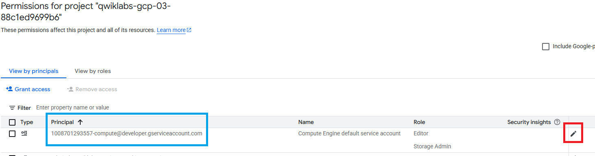
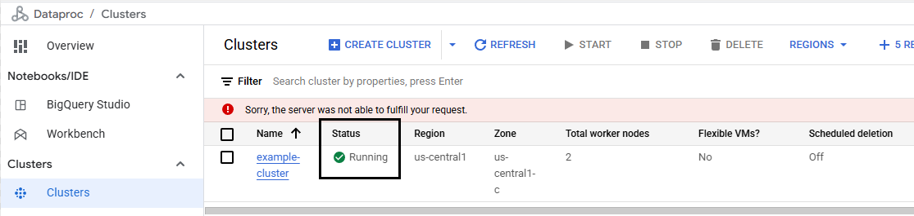
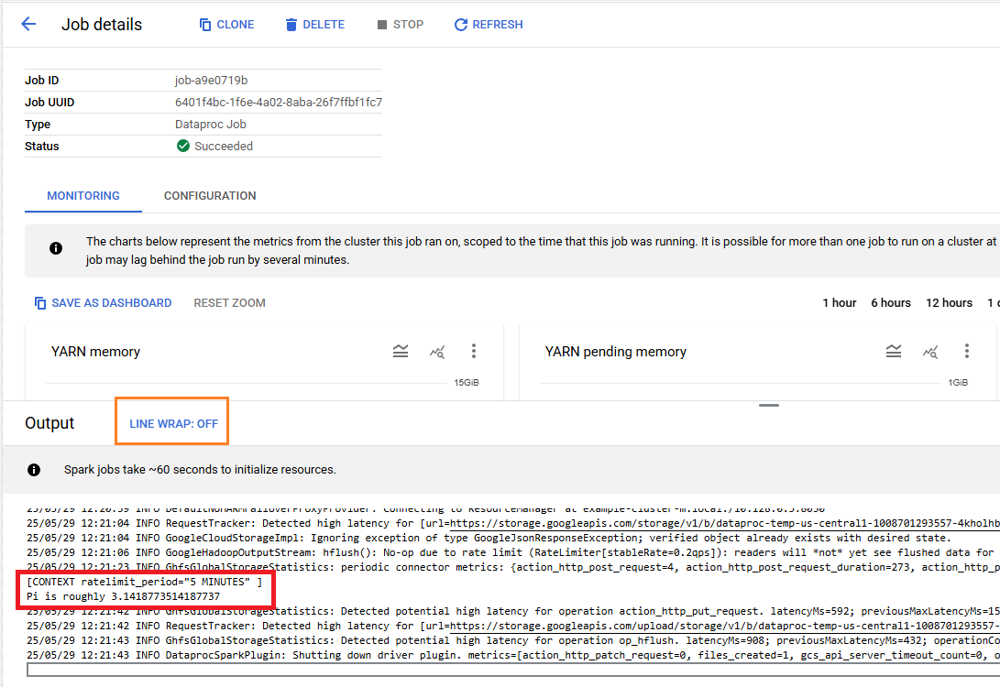
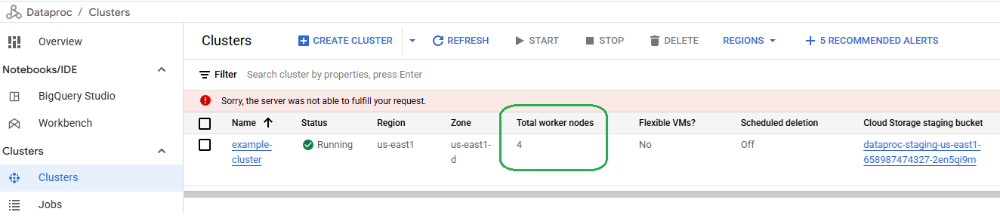

# 🚀 GSP103 - Dataproc: Inicio rápido con la consola

## 🧠 Objetivo

En este lab vas a aprender a:

- Conceder permisos a la cuenta de servicio.
- Crear un clúster de Dataproc.
- Ejecutar un trabajo de Spark desde la consola.
- Ver la salida del trabajo.
- Modificar el número de nodos de trabajo.
- Validar tu comprensión mediante preguntas de opción múltiple.

---

## 🔐 Permisos a la cuenta de servicio

1. Ir al menú de navegación > **IAM & Admin** > **IAM**.
2. Hacer clic en el ícono del lápiz al lado de la cuenta `compute@developer.gserviceaccount.com`.
3. Hacer clic en **+ ADD ANOTHER ROLE**.
4. Seleccionar el rol **Storage Admin**.
5. Hacer clic en **Save**.

   
    

---

## 🧱 Task 1: Crear un clúster

1. Ir al menú de navegación > **View all products** > **Dataproc** > **Clusters**.
2. Clic en **Create cluster** > **Cluster on Compute Engine**.
3. Configurar los siguientes campos:

| Campo                          | Valor                |
|-------------------------------|----------------------|
| Name                           | `example-cluster`    |
| Region                         | _(elegir región)_    |
| Zone                           | _(elegir zona)_      |
| Primary disk type (Master)     | Standard Persistent Disk |
| Machine Series (Master)        | E2                   |
| Machine Type (Master)          | `e2-standard-2`      |
| Disk Size (Master)             | 30 GB                |
| Number of Worker Nodes         | 2                    |
| Primary disk type (Workers)    | Standard Persistent Disk |
| Machine Series (Workers)       | E2                   |
| Machine Type (Workers)         | `e2-standard-2`      |
| Disk Size (Workers)            | 30 GB                |
| Internal IP only               | ❌ Deseleccionar  (Customize cluster (optional))   |
                                
4. Clic en **Create**. Esperar a que el estado cambie a `Running`.

    

### **Cuando creás un cluster de Dataproc, automáticamente genera dos buckets de Cloud Storage si no los especificás vos manualmente.**

 Estos son:

| Bucket                 | ¿Para qué sirve?                                                                                                                |
| ---------------------- | ------------------------------------------------------------------------------------------------------------------------------- |
| `dataproc-staging-...` | Se usa para almacenar archivos temporales que necesita el cluster para ejecutar jobs, como los JAR, archivos Python, o scripts. |
| `dataproc-temp-...`    | Se usa para archivos temporales generados durante la ejecución de los jobs, por ejemplo, resultados intermedios.                |

⚙️ ¿Por qué los crea automáticamente?

Dataproc necesita espacio para:

- Subir archivos que se van a usar en el job (como los .jar del ejemplo de SparkPi).

- Guardar resultados temporales o de staging durante la ejecución de jobs distribuidos.

- Hacer logging y debugging (algunos jobs pueden volcar logs allí).

    
---

## 🧮 Task 2: Ejecutar un trabajo de Spark

1. Ir a la pestaña **Jobs** en Dataproc y hacer clic en **Submit Job**.
2. Completar con:

| Campo        | Valor                                             |
|--------------|---------------------------------------------------|
| Region       | _(la misma que en el clúster)_                   |
| Cluster      | `example-cluster`                                 |
| Job type     | `Spark`                                           |
| Main class   | `org.apache.spark.examples.SparkPi`              |
| Jar files    | `file:///usr/lib/spark/examples/jars/spark-examples.jar` |
| Arguments    | `1000` (número de puntos a calcular)             |

3. Clic en **Submit**.

### 🧩 ¿Qué estás ejecutando?

Este Job ejecuta un ejemplo llamado SparkPi, que calcula un valor aproximado de π (pi) usando el método de Monte Carlo. Es un ejemplo clásico para mostrar cómo Spark paraleliza el trabajo en un clúster.

### 📄 Detalle del Job

| Campo          | Valor                                                    | ¿Qué significa?                                                                                     |
| -------------- | -------------------------------------------------------- | --------------------------------------------------------------------------------------------------- |
| **Region**     | (la misma que el clúster)                                | Asegura que el job se ejecute **donde está el clúster** para evitar errores o latencia.             |
| **Cluster**    | `example-cluster`                                        | El nombre del clúster Dataproc donde se ejecuta el job.                                             |
| **Job type**   | `Spark`                                                  | Tipo de trabajo: en este caso, un **programa Spark** (podría ser Hadoop, PySpark, etc.).            |
| **Main class** | `org.apache.spark.examples.SparkPi`                      | La clase principal del programa. En este caso, SparkPi (viene preinstalada como ejemplo).           |
| **Jar files**  | `file:///usr/lib/spark/examples/jars/spark-examples.jar` | El JAR que contiene el código. Este es un ejemplo incluido por defecto en los clústeres Dataproc.   |
| **Arguments**  | `1000`                                                   | Le dice al programa cuántos puntos aleatorios generar para estimar Pi. A más puntos, más precisión. |

### ¿Cómo funciona SparkPi?

Este job usa un algoritmo de Monte Carlo para estimar π.

-  Spark divide ese trabajo entre los nodos del clúster, cada uno hace su parte y luego combinan los resultados.

### ¿Para qué sirve?

- Es un ejemplo clásico de procesamiento paralelo.

- Te muestra cómo un job aprovecha los recursos distribuidos del clúster.

- Te enseña a usar argumentos, JARs, clases, etc., en un job Spark real.

---

## 🔍 Task 3: Ver la salida del job

1. Hacer clic en el ID del job en la lista.
2. Activar **LINE WRAP** para ver mejor la salida.
3. Buscar el valor estimado de **pi** en el log.

   
---

## 🔄 Task 4: Modificar el número de workers

1. Ir a **Clusters**, hacer clic en `example-cluster`.
2. Ir a la pestaña **Configuration**, hacer clic en **Edit**.
3. Cambiar **Worker nodes** de 2 a **4**.
4. Clic en **Save**.

   Luego podés volver a ejecutar el mismo job de Spark para probar el nuevo tamaño del clúster.

   
---

